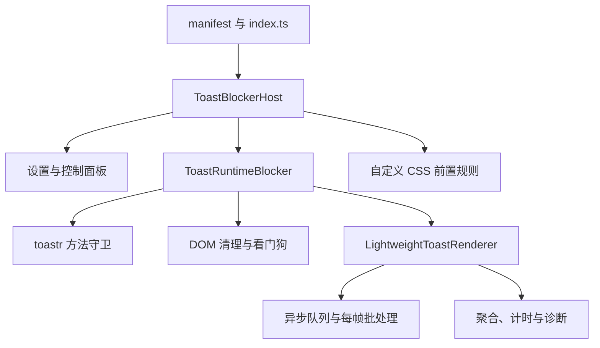
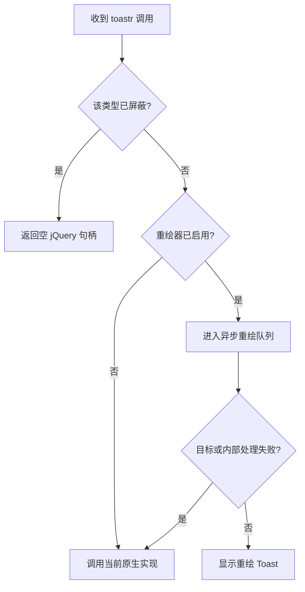

# SillyTavern Toast Blocker 开发文档

> 文档对应版本：`1.4.1`（自动化验收通过，真机回测待补）
> 修订日期：2026-09-05
> 仓库：<https://github.com/qyh9527/SillyTavern-Toast-Blocker>
> 运行环境：原生 SillyTavern、TauriTavern 及其系统 WebView

## 1. 项目定位

SillyTavern Toast Blocker 是一个 TypeScript 编写的纯前端扩展，用于控制全局 `toastr` 通知的显示方式。

核心能力：

- 分别屏蔽 `success`、`info`、`warning`、`error` 四类 Toast。
- 使用持久化自定义 CSS，处理扩展脚本加载前出现的启动 Toast。
- 使用运行时方法守卫和 DOM 清理，处理扩展加载后的 Toast。
- 将未屏蔽的 Toast 交给异步轻量重绘器。
- 接管重绘器启动前已经存在的原生 Toast，并允许整卡点击关闭。
- 聚合短时间内重复出现的通知。
- 在页面进入后台或锁屏时纠正 Toast 计时。
- 提供仅保存在内存中的性能诊断。
- 一键生成并复制不含正文的本地自检报告；复制受限时提供手动复制。
- 启动原生 Toast 与新重绘 Toast 共享可见上限、公开清理接口和停用清理。
- 扩展更新后自动刷新前端，并提供带二次确认的手动刷新按钮。

项目没有运行时第三方依赖，不使用 Node.js API、Tauri 私有命令或平台专属全局对象。

## 2. 技术栈与构建目标

| 项目 | 当前配置 |
| --- | --- |
| 源码语言 | TypeScript 5.9 |
| JavaScript 目标 | ES2022 |
| 模块格式 | 原生 ES Module |
| 类型检查 | `strict`、`exactOptionalPropertyTypes`、`noUncheckedIndexedAccess` |
| DOM 类型 | `DOM`、`DOM.Iterable` |
| 单元测试 | Node.js 内置 `node:test` |
| 浏览器测试 | Playwright；Chromium/WebKit × 桌面/移动视口 |
| 测试夹具依赖 | jQuery 3.7.1、Toastr 2.1.4，仅开发依赖 |
| CI Node 版本 | Node.js 22 |
| 打包器 | 无 |
| 运行时依赖 | 无 |

源码编译到 `dist/`。`manifest.json` 直接加载 `dist/index.js`，因此发布时必须提交编译产物。

## 3. 项目结构

```text
SillyTavern-Toast-Blocker/
├─ .github/workflows/test.yml   # GitHub Actions
├─ src/
│  ├─ index.ts                  # 扩展入口与生命周期导出
│  ├─ host.ts                   # 设置持久化、操作面板、公开 API
│  ├─ host-adapter.ts          # context 优先、缺失宿主 API 动态导入
│  ├─ diagnostics-view.ts      # 可视化诊断模型、模板与增量文字更新
│  ├─ self-check.ts            # 白名单自检报告、剪贴板降级
│  ├─ version.ts               # 自检版本，与发布元数据一致
│  ├─ core.ts                   # 配置模型、前置 CSS、toastr 方法守卫
│  ├─ runtime.ts                # 屏蔽器与重绘器的运行时编排
│  ├─ renderer.ts               # 异步 Toast 重绘器
│  ├─ interaction.ts           # 二次确认状态机
│  ├─ reload.ts                 # 单页去重刷新调度器
│  └─ types/                    # SillyTavern 与全局对象类型声明
├─ dist/                        # TypeScript 编译产物，发布必需
├─ tests/                       # Node 自动化测试
├─ e2e/                         # 浏览器夹具、静态服务和 10 个测试场景
├─ playwright.config.mjs        # 4 个引擎/视口组合
├─ scripts/check-release.mjs    # 版本与入口检查
├─ docs/                        # 开发文档、未来更新建议
├─ style.css                    # 面板、胶囊开关和重绘 Toast 样式
├─ manifest.json                # SillyTavern 扩展清单
├─ package.json
└─ tsconfig.json
```

## 4. 总体架构



各层职责保持单向：

1. `index.ts` 只负责入口和生命周期。
2. `host.ts` 管理设置、UI、保存和刷新；通过 `host-adapter.ts` 获取宿主接口，业务模块不再静态导入宿主内部文件。
3. `runtime.ts` 决定一个 Toast 应该被屏蔽、重绘还是交还原生实现。
4. `core.ts` 提供无 UI 的纯逻辑和方法守卫。
5. `renderer.ts` 只负责重绘器队列、DOM、生命周期兼容和诊断。

## 5. 扩展清单与加载时序

`manifest.json` 的关键字段：

```json
{
  "loading_order": -100000,
  "js": "dist/index.js",
  "css": "style.css",
  "version": "1.4.1",
  "auto_update": true,
  "minimum_client_version": "1.12.13"
}
```

`loading_order: -100000` 让扩展尽可能早于普通第三方扩展激活，但它不能保证早于宿主启动阶段的所有 Toast。尤其在 TauriTavern 中，普通第三方扩展可能在主界面准备完成后才激活。

为弥补这个时序差，项目使用三层防护：

| 层级 | 生效时机 | 实现 |
| --- | --- | --- |
| 持久前置规则 | 下次页面启动、扩展脚本执行前 | 把带边界标记的规则写入 `power_user.custom_css` |
| 方法守卫 | 扩展脚本执行后 | 用 accessor 包装 `toastr.success/info/warning/error` |
| DOM 兜底 | 扩展脚本执行后 | `MutationObserver` 与周期看门狗清理漏网节点 |

首次安装当页只能可靠处理扩展加载后的 Toast。前置规则写入后，需要用户重启一次前端，才能覆盖更早的启动阶段。

### 5.1 前置 CSS 的边界标记

项目只管理以下标记之间的内容：

```css
/* SillyTavern Toast Blocker: managed start */
/* 自动生成的规则 */
/* SillyTavern Toast Blocker: managed end */
```

`stripManagedCss()` 会删除所有旧管理区块，`updateManagedCss()` 再追加唯一的新区块。用户原有的自定义 CSS 不会被整体覆盖。

### 5.2 重绘器启动接管规则

重绘器启用时，前置 CSS 会临时隐藏原生 `#toast-container`，直到根元素出现：

```text
qyh-toast-redraw-ready
```

如果扩展没有成功启动，CSS 动画会在 8 秒后释放隐藏状态，避免通知永久不可见。

## 6. 生命周期

`src/index.ts` 导出以下生命周期函数：

| Hook | 行为 |
| --- | --- |
| `onActivate` | 应用当前配置并挂载面板 |
| `onInstall` | 默认启用、保存前置规则并挂载面板 |
| `onUpdate` | 强制保存配置，随后调度一次前端刷新 |
| `onEnable` | 重新应用并保存前置规则 |
| `onDisable` | 停止运行时功能并移除前置规则 |
| `onClean` | 停止功能、删除设置、移除面板和规则 |
| `onDelete` | 与 `onClean` 相同 |

入口还会顶层 `await installToastBlockerHost()`，用于兼容尚未实现完整 lifecycle hooks 的宿主。`Symbol.for('qyh9527.sillytavern.toastBlocker')` 缓存初始化 Promise 和完成后的控制器，重复激活不会创建多个实例。宿主接口解析失败时删除失败的单例占位并抛出错误，不创建假的设置存储。

### 6.1 宿主接口适配

优先从 `SillyTavern.getContext()` 取得 `extensionSettings`、`powerUserSettings`、`saveSettings`、`saveSettingsDebounced`。缺失字段分别动态导入 `/scripts/extensions.js`、`/scripts/power-user.js`、`/script.js`。这些路径只出现在适配层。

当前核对的宿主 context 提供防抖保存，但不一定提供可等待完成的 `saveSettings`；因此 `mixed` 是正常模式，不是错误。刷新前始终等待真实保存 Promise，不能把调用防抖函数当作已经落盘。适配状态为 `context`、`mixed`、`legacy`。

## 7. 设置模型

设置保存在：

```text
extension_settings.qyh_toast_blocker
```

当前结构：

```ts
interface ToastBlockerSettings {
  enabled: boolean;
  blockedLevels: {
    success: boolean;
    info: boolean;
    warning: boolean;
    error: boolean;
  };
  redrawEnabled: boolean;
  redrawMaxVisible: number;
  redrawAggregateDuplicates: boolean;
  diagnosticsEnabled: boolean;
  logSuppressed: boolean;
  schemaVersion: 4;
}
```

默认值：

| 设置 | 默认值 | 说明 |
| --- | --- | --- |
| `enabled` | `true` | 启用分类屏蔽 |
| 四类 `blockedLevels` | 全部 `true` | 默认屏蔽全部 Toast |
| `redrawEnabled` | `false` | 默认不重绘未屏蔽 Toast |
| `redrawMaxVisible` | `6` | 范围 1–20 |
| `redrawAggregateDuplicates` | `true` | 默认聚合重复通知 |
| `diagnosticsEnabled` | `false` | 默认不采集批次性能指标 |
| `logSuppressed` | `false` | 默认不输出屏蔽记录 |

`normalizeSettings()` 负责旧设置迁移和非法值归一化。新增设置字段时不能直接读取原对象，必须在此函数中提供兼容默认值。

## 8. Toast 决策顺序

每次调用 `toastr.success/info/warning/error` 时，运行时按固定优先级处理：



屏蔽始终优先于重绘。因此四类全部屏蔽时，即使重绘器开启，也不会显示 Toast。

## 9. toastr 方法守卫

`guardToastrMethods()` 不只是把方法赋值成新函数，而是为每个可配置属性安装 getter/setter：

- getter 始终返回守卫函数。
- setter 接收后加载脚本赋入的新实现，并保存为最新底层函数。
- 关闭扩展时，`restore()` 恢复最近一次被赋入的实现。
- 属性不可配置时跳过该方法，CSS 和 DOM 兜底仍继续工作。

这样可以抵抗后加载扩展再次执行：

```js
toastr.info = anotherImplementation;
```

重绘器启用时还会包装 `toastr.clear()` 和 `toastr.remove()`。重绘句柄由重绘器处理，原生句柄继续交给宿主实现。

## 10. 运行时兜底

`ToastRuntimeBlocker` 包含两类兜底：

### 10.1 MutationObserver

屏蔽器有效时启动定向监听：

- 若 `#toast-container` 已存在，只观察该容器的 `childList`，发现新增节点后删除所选类型的原生 Toast。
- 若容器尚未创建，先观察主文档子树等待它出现，一旦找到，使用同一个观察器立即切换并清理新增通知；完成切换后，聊天流式更新不会触发该观察器。
- v1.4.0 修正 v1.3.1 启动分支引用旧观察器、导致切换判断无法通过的问题。
- 容器移除或重建后，看门狗重新绑定，延迟取决于当前 1 秒或 5 秒巡检周期；前置 CSS 仍提供视觉屏蔽。
- 等待容器出现阶段尚无超时停止机制；如果宿主长期没有创建容器，整树等待观察仍存在，列为后续优化。
- 宿主 `document` 不提供 `querySelector` 时跳过 DOM 监听，方法守卫与前置 CSS 仍继续工作。

### 10.2 自适应看门狗

每个周期检查：

- 运行时屏蔽样式是否仍存在。
- 全局 `toastr` 对象是否被整体替换。
- 已屏蔽类型是否出现漏网节点。
- 是否出现可由重绘器接管的早期原生 Toast。

节律与可见性策略：

- 启动阶段以 1 秒间隔快速检查，8 个周期后退避到 5 秒低频巡检。
- 页面进入后台时暂停定时器；启动时已经处于后台也不创建巡检定时器。回到前台立即补一次检查并恢复周期巡检。
- 看门狗只在屏蔽器或重绘器至少有一个生效时运行。

## 11. 重绘器

核心类：`LightweightToastRenderer`。

### 11.1 性能约束

| 约束 | 数值或实现 |
| --- | --- |
| 单帧最多创建 | 12 个 Toast |
| 等待队列上限 | 100 个请求 |
| 同时可见范围 | 1–20 个 |
| 默认同时可见 | 6 个 |
| 重复聚合窗口 | 1000 ms |
| 帧预算参考 | 约 16.67 ms |

同步 Toast 风暴先进入内存队列。`queueMicrotask()` 合并同一轮调度，再由 `requestAnimationFrame()` 分帧处理。相同容器的节点通过 `DocumentFragment` 一次写入，减少重复布局。

如果没有 `requestAnimationFrame()`，则回退到约 16 ms 的 `setTimeout()`。

动画和进度条只修改 `transform`、`opacity`。进度条优先使用 Web Animations API；不支持时，自动消失计时仍然有效。

### 11.2 容器管理

容器按“挂载目标 + `positionClass`”区分，并保存在 `WeakMap` 中。支持 Toastr 常见位置：

- `toast-top-right`
- `toast-top-left`
- `toast-top-center`
- `toast-bottom-right`
- `toast-bottom-left`
- `toast-bottom-center`
- `toast-top-full-width`
- `toast-bottom-full-width`

非 `body` 目标使用绝对定位。移动端位置包含 `safe-area-inset-*`，避免被刘海或系统手势区域遮挡。

自定义 `target` 无效或选择器非法时，当前通知立即回退到原生 Toastr。

### 11.3 可见数量与队列溢出

- 新重绘 Toast 和启动接管 Toast 共享 `redrawMaxVisible`；超限时按统一登记顺序移除最早通知。
- 启动批次根据 `newestOnTop` 将原容器顺序转换为从旧到新的淘汰顺序。
- 没有可接管节点时不创建空重绘容器。
- 等待队列超过 100 时，最早等待请求被淘汰。
- 淘汰仍会执行对应的 `onHidden` 回调，保持生命周期完整。

### 11.4 点击关闭

所有重绘 Toast 都支持整卡点击关闭，即使调用方设置了 `tapToDismiss: false`。

如果存在：

- `onclick`：先执行回调，再关闭卡片。
- `closeButton`：创建独立关闭按钮。
- `onCloseClick`：点击关闭按钮时执行。

启动阶段接管的原生 Toast 会直接移动原节点，因此其中已有的链接、按钮和监听器仍然保留。整卡关闭使用零延迟任务，让子元素操作先完成。

启动节点登记于独立 `adopted` 注册表，通过 `visibleOrder` 与新重绘节点共同管理数量。调用 `clear/remove` 或停用时先解除归属，再调用宿主移除函数，防止守卫递归。宿主自行移除节点时，由只观察重绘容器 `childList` 的观察器回收登记与空容器；整个挂载目标被卸载或缺少观察器时，看门狗补查。

插件不补发原生 `onShown/onHidden`，也无法保证宿主强制 `remove` 会触发 `onHidden`；这是原生 Toastr 路径的边界，与新重绘通知自行管理的生命周期不同。

## 12. 重复通知聚合

聚合默认开启。1 秒内满足以下条件的通知会合并为同一张卡片，并显示 `×N`：

- 类型相同。
- 标题和正文都是可稳定序列化的原始值且内容相同。
- 挂载目标和位置相同。
- 图标、样式类、HTML 转义、关闭按钮、点击关闭、悬停、进度条、排序、各项时长、RTL 等关键选项相同。

以下通知不会参与聚合：

- `preventDuplicates: true`：继续遵循 Toastr 原始的直接去重语义。
- 带 `onclick` 或 `onCloseClick`：避免把独立交互合并掉。
- 标题或正文为对象、DOM 节点等非原始值：避免不稳定序列化和隐式读取正文。

合并后：

- 返回第一张 Toast 的同一句柄。
- 活跃 Toast 的自动消失计时重新开始。
- 每个逻辑通知自己的 `onShown`、`onHidden` 都会保留并执行。
- 聚合只改变展示数量，不吞掉生命周期回调。

## 13. 后台计时纠偏

WebView 和浏览器通常会限制后台页面定时器。重绘器监听标准 `visibilitychange`：

1. 页面隐藏时，记录 `timerDeadline - Date.now()` 得到剩余时长。
2. 清除当前定时器并暂停进度动画。
3. 页面恢复可见时，从剩余时长继续计时并播放动画。

计时状态区分：

- `hoverPaused`：用户悬停造成的暂停。
- `visibilityPaused`：页面进入后台造成的暂停。

两种状态分开存储，避免从后台恢复时误启动仍处于悬停状态的 Toast。

注意：这一套剩余时间管理适用于重绘器创建的 Toast。启动阶段被移动进重绘容器的原生节点保留宿主原有计时器，插件负责视觉位置、点击关闭、统一可见数量、清理与统计；不承诺冻结这些原生通知的剩余时间。

## 14. 本地性能诊断

诊断开关开启后显示以下指标：

| 指标 | 含义 |
| --- | --- |
| 已重绘 | 当前统计周期创建或接管的数量 |
| `active`（API/报告） | 新重绘和启动接管的当前总数 |
| `adoptedActive`（API/报告） | 启动接管的当前数量，是 active 的子集 |
| 已聚合 | 被合并进现有卡片的逻辑通知数量 |
| 队列峰值 | 等待队列历史最高长度 |
| 后台暂停 | 因页面隐藏而冻结计时的累计次数 |
| 平均批次 | `flushBatch()` 平均执行耗时 |
| 最慢批次 | 单次 `flushBatch()` 最大耗时 |
| 超帧预算 | 超过约 16.67 ms 的批次数 |
| 页面长帧 | WebView 提供相应观察条目时的页面级长帧数 |

页面级诊断按能力选择：

1. 优先使用 `long-animation-frame`。
2. 不支持时尝试 `longtask`。
3. 两者都不支持时，仅保留重绘批次自身耗时。

通过 `PerformanceObserver.supportedEntryTypes` 做特性检测，因此不支持增强诊断的 WebView 不会报错，也不会影响屏蔽和重绘。

诊断数据只存在当前页面内存中：

- 不保存到配置。
- 不上传。
- 不读取或记录 Toast 正文。
- 页面刷新后自然清空。

“清空诊断统计”会重置重绘、淘汰、回退、聚合、队列峰值、后台暂停和耗时统计。

### 14.1 一键自检报告

按钮独立于性能诊断开关，点击时才生成报告。`ToastBlocker.selfCheck()` 返回相同 JSON 字符串。

报告白名单包括插件版本、报告结构版本、适配来源、浏览器能力布尔值、归一化后的插件设置、守卫数量、规则是否存在、通知计数和性能数字。检查早期规则缺失、守卫不足、运行时样式缺失，以及“四类屏蔽导致无重绘”的配置。

不序列化宿主 context、完整 UA、Toast 标题正文、聊天、密钥、URL、自定义 CSS 内容。只检查本插件规则是否存在，不判断整个宿主系统健康，也不验证 CSS 是否遭到第三方更高优先级规则覆盖。

先调用标准 `navigator.clipboard.writeText()`；不可用或拒绝时，在面板显示只读文本框并选中文本，由用户手动复制，不反复请求权限、不自动上传。

### 14.2 v1.4.1 可视化诊断与空白框修复

用户在真机观察到的空白块是隐藏失败的备用报告 textarea。宿主 `textarea { display: block }` 能覆盖浏览器默认的隐藏样式；本版添加 `#qyh-toast-blocker-panel [hidden] { display: none !important; }`，只影响本插件面板。报告框仅在复制失败时展开，限制高度；复制成功后收起。[MDN：hidden 与 display](https://developer.mozilla.org/en-US/docs/Web/HTML/Reference/Global_attributes/hidden)

原区域新增 `diagnostics-view.ts` 提供的诊断概览，旧诊断数字也移至该区域。概览显示规则存在性、方法守卫数量、宿主适配、当前通知、待显示队列、重绘批次和页面长帧。健康标识由规则与守卫等检查项决定，不能因为整页有长帧就判断插件故障。`mixed` 表示公开接口和兼容导入混用，是正常模式。

`frameSamples === 0` 时显示“暂无批次样本”，进度条为空；有样本后，条形只把平均批次耗时与约 16.7 ms 参考预算比较，不表示 CPU 占用、FPS 或整个插件耗时。启动接管的通知或启用诊断前的通知可以增加已重绘数量而没有批次样本。

页面长帧卡片明确标注包含酒馆、主题和其他扩展，不能归因于本插件。报告新增 `observerType`、`timingSampleState`、`pageTimingScope`、`pageTimingCollection`，`reportSchema` 升为 2。旧数字字段保留；持久设置 `schemaVersion` 仍为 4。

性能观察器使用 `buffered: false`，不回填采集前的历史；相同采集会话中的配置变化复用观察器。清零先调用 `takeRecords()` 丢弃待处理条目，停用后的过时回调不再增加统计。本页计数累计启用期间的新条目，刷新或清零后重置。[MDN：PerformanceObserver.observe](https://developer.mozilla.org/en-US/docs/Web/API/PerformanceObserver/observe)

概览与数字沿用已有 rAF 合批，没有新增周期轮询；抽屉关闭时跳过写回。

## 15. 操作面板与样式隔离

控制面板挂载到：

```text
#extensions_settings2 或 #extensions_settings
```

如果挂载点尚未出现，使用 `MutationObserver` 等待，最长等待 5 秒。

所有自定义面板样式都以：

```css
#qyh-toast-blocker-panel
```

作为作用域，降低与宿主主题或其他扩展冲突的概率。

### 15.1 胶囊开关

面板内 checkbox 使用原生 `<input type="checkbox">` 保留键盘和无障碍语义，但通过高特异性 CSS 重绘成胶囊：

- `appearance: none !important` 清除平台默认外观。
- `::before` 被强制禁用。
- `::after` 只绘制圆形滑块，不使用 `✓` 字符。
- 开启时滑块位移、背景高亮。
- 关闭时背景和卡片灰暗。

四种 Toast 类型在移动端始终使用 `2×2` 网格，整张 `<label>` 卡片都可点击。

### 15.2 状态渲染合批

- 同一帧内重复的 `renderStatus()` 调用会合并成一次 `requestAnimationFrame` 重绘；不支持 rAF 时退回约 100 ms 定时器。
- 只有诊断已开启且 `.inline-drawer-content` 实际拥有布局矩形时才写回诊断数字；打开抽屉时主动请求状态刷新。
- v1.4.0 不再依赖宿主可能不存在的 `inline-drawer-collapsed` 类；其余状态行和开关仍按帧合批。

### 15.3 减少动态效果

在 `prefers-reduced-motion: reduce` 下，面板过渡和 Toast 进出动画会缩短到 1 ms。

## 16. 前端刷新

### 16.1 更新后自动刷新

`onUpdate()` 先调用：

```ts
controller.activate({ forceSave: true });
```

保存并恢复现有配置后，再通过 `scheduleFrontendReload()` 以零延迟任务刷新页面。刷新调度器在单页生命周期内只允许安排一次，避免同一次更新重复刷新。

### 16.2 手动刷新与防误触

“立即刷新前端”按钮使用 `createTimedConfirmation()`：

1. 第一次点击只进入确认状态。
2. 5 秒内第二次点击才会保存设置并刷新。
3. 超过 5 秒自动取消。
4. 确认后先等待 `saveSettings()`，再执行刷新。

## 17. 控制台公开 API

插件安装后会暴露只读的 `globalThis.ToastBlocker`：

```js
await ToastBlocker.enable();
await ToastBlocker.disable();
await ToastBlocker.repair();

await ToastBlocker.setLevel('success', true);
await ToastBlocker.setLevel('info', false);
await ToastBlocker.setLevel('warning', false);
await ToastBlocker.setLevel('error', true);

await ToastBlocker.redraw(true);
await ToastBlocker.aggregate(true);
await ToastBlocker.diagnostics(true);
ToastBlocker.resetDiagnostics();

console.log(ToastBlocker.status());
console.log(ToastBlocker.selfCheck());
await ToastBlocker.shutdown();
```

| 方法 | 作用 |
| --- | --- |
| `enable()` | 开启分类屏蔽并保存前置规则 |
| `disable()` | 关闭屏蔽；重绘器设置保持不变 |
| `repair()` | 强制重写并保存当前前置规则 |
| `setLevel(level, blocked)` | 设置单一 Toast 类型 |
| `redraw(enabled)` | 开关重绘器 |
| `aggregate(enabled)` | 开关重复通知聚合 |
| `diagnostics(enabled)` | 开关本地性能诊断 |
| `resetDiagnostics()` | 清空当前页面诊断数据 |
| `status()` | 返回运行状态、配置和统计 |
| `selfCheck()` | 返回白名单 JSON 自检报告，不操作剪贴板、不上传 |
| `shutdown()` | 同时关闭屏蔽器和重绘器并清理规则 |

`setLevel()` 的 `level` 只能是 `success`、`info`、`warning`、`error`。

## 18. Toastr 兼容范围

重绘器兼容常用 Toastr 契约：

- 标题与正文。
- 四种通知类型。
- `escapeHtml`。
- `toastClass`、`titleClass`、`messageClass`、`iconClasses`。
- `closeButton`、`closeClass`、`onCloseClick`。
- `onclick`、整卡关闭。
- `timeOut`、`extendedTimeOut`、`showDuration`、`hideDuration`、`closeDuration`。
- `closeOnHover`、`progressBar`、`progressClass`。
- `positionClass`、`target`、`newestOnTop`、`rtl`。
- `preventDuplicates`。
- `clear()` 和 `remove()`，覆盖新重绘与已登记的启动接管句柄。
- 新重绘 Toast 的 `onShown` 与 `onHidden`；已存在原生节点仍遵循原生回调行为。

边界：

- 第三方代码直接操作原生 `#toast-container` 时，不保证完全等价。
- 高度自定义的 DOM 模板不保证被重新生成；启动接管路径会尽量保留原节点。
- `escapeHtml: false` 时使用 `innerHTML`，与 Toastr 常见行为一致；调用方不应传入不可信 HTML。
- 只处理当前主文档的全局 `toastr`，不能控制跨域 iframe 内的独立脚本上下文。
- 插件只改变视觉通知，不会吞掉业务异常、网络错误或控制台错误。

## 19. 无障碍设计

- Success、Info 使用 `role="status"`。
- Warning、Error 使用 `role="alert"`。
- Toast 使用 `aria-atomic="true"`。
- 重复计数徽章包含 `aria-label="重复 N 次"`。
- 关闭按钮包含明确的 `aria-label`。
- 类型卡片保留原生 checkbox，可通过键盘聚焦和切换。
- 设置状态区域使用 `role="status"`。

## 20. TauriTavern 与多平台 WebView 兼容

TauriTavern 覆盖 Windows、Linux、Android、iOS 和 macOS。各平台使用的系统 WebView 不完全相同：

| 平台 | 常见 WebView |
| --- | --- |
| Windows | WebView2 / Chromium |
| Linux | WebKitGTK |
| iOS、macOS | WKWebView |
| Android | Android System WebView |

兼容策略：

- 不调用 Tauri bridge。
- 不依赖 Node.js 或 Electron API。
- 只使用 ES2022、DOM、Page Visibility、Web Animations 等浏览器能力。
- `PerformanceObserver` 相关能力全部先检测再使用。
- Web Animations 不可用时，仍保留普通计时关闭。
- `requestAnimationFrame` 不可用时回退到定时器。
- `color-mix()` 之前逐条垫静态颜色回退声明；旧 WebView 不支持时自动落到近似色。
- Toast 容器高度先写 `vh` 再写 `dvh`，不支持 `dvh` 的引擎保留 `vh`。
- 面板 `:has()` 与 `.is-selected` 类双轨提供选中态高亮；即使两者都不支持，checkbox 本身仍可操作。
- Toast 位置使用安全区变量适配移动设备。

参考资料：

- [SillyTavern 扩展开发文档](https://docs.sillytavern.app/for-contributors/writing-extensions/)
- [TauriTavern 平台说明](https://github.com/Darkatse/TauriTavern/blob/main/README.en.md)
- [Tauri WebView 版本说明](https://v2.tauri.app/reference/webview-versions/)
- [Tauri 进程模型](https://v2.tauri.app/concept/process-model/)
- [MDN Page Visibility API](https://developer.mozilla.org/en-US/docs/Web/API/Page_Visibility_API)
- [MDN PerformanceObserver.supportedEntryTypes](https://developer.mozilla.org/en-US/docs/Web/API/PerformanceObserver/supportedEntryTypes_static)

## 21. 本地开发

### 21.1 环境要求

- Node.js 22，建议与 CI 一致。
- npm。
- 一个可用于手动验证的 SillyTavern 或 TauriTavern 环境。

### 21.2 安装依赖

```bash
npm ci
```

### 21.3 编译

```bash
npm run build
```

### 21.4 仅类型检查

```bash
npm run check
```

### 21.5 完整测试

```bash
npm test
npm run check:release
```

浏览器测试：

```bash
npx playwright install --with-deps chromium webkit
npm run test:e2e
```

`npm test` 会先重新生成 `dist/`，再运行全部 Node 测试。

## 22. 测试结构

| 文件 | 覆盖范围 |
| --- | --- |
| `core.test.mjs` | 设置迁移、前置 CSS、方法守卫 |
| `renderer.test.mjs` | 批处理、可见上限、聚合、计时、点击关闭、接管、诊断 |
| `runtime.test.mjs` | 屏蔽优先级、恢复原生方法、运行状态、定向监听 |
| `interaction.test.mjs` | 二次确认与超时取消 |
| `reload.test.mjs` | 刷新延迟和单页去重 |
| `manifest.test.mjs` | 加载顺序、hooks、版本同步 |
| `diagnostics-view.test.mjs` | 实机数据语义、页面长帧不归因、空样本和故障提示 |
| `host-adapter.test.mjs` | context/混合/旧宿主路径、真实保存屏障和失效处理 |
| `self-check.test.mjs` | 敏感字段排除、异常提示和剪贴板降级 |
| `e2e/plugin.spec.mjs` | 实际 jQuery/Toastr 加载的浏览器交互测试 |
| `style.test.mjs` | 移动端 2×2 布局、选中态、胶囊开关和无勾号回归 |

本轮验证记录（2026-09-05）：

| 验证项 | 结果 |
| --- | --- |
| `npm test` | 46/46 通过；v1.4.0 基线 42 项 |
| `npm run check` | 通过 |
| `npm run check:release` | 通过；manifest/package/lock 根记录/编译版本一致 |
| `git diff --check` | 通过 |
| `npm run check:dist` | 本地提交后与远端 CI 均通过 |
| Playwright E2E | v1.4.1 远端 CI 40/40 通过；10 个场景 × Chromium/WebKit × 桌面/移动视口 |
| 真实 ST/TT 与平台设备 | 未执行；不能据此声明全平台验证通过 |

E2E 使用最小宿主夹具、实际 jQuery 3.7.1 和 Toastr 2.1.4；不是完整酒馆启动，也不是 TT 容器真机。

v1.4.1 验证证据：[GitHub Actions #17](https://github.com/qyh9527/SillyTavern-Toast-Blocker/actions/runs/33951559152)，运行时代码提交 `9e232aae2add8c99816cbd5f0da63f67805587ff`，46 项单测与 40 项浏览器用例均通过。

v1.4.0 历史验证证据：[GitHub Actions #12](https://github.com/qyh9527/SillyTavern-Toast-Blocker/actions/runs/33950757088)，测试代码提交 `2c1f11458b9a81bfcb286eb97a4faaaf330cf468`。本地 Node.js 24.19.0 完成单测与构建，CI 使用 Node.js 22。本地因缺少浏览器可执行文件未进入 E2E 页面断言，随后远端 CI 安装浏览器成功并完成全部用例。

GitHub Actions 在每次 `push` 和 `pull_request` 时执行：

```text
npm ci
npm run check
npm test
npm run check:release
npm run check:dist
npx playwright install --with-deps chromium webkit
npm run test:e2e
```

E2E 当前覆盖：屏蔽/聚合/恢复原生、启动通知上限与按钮/移除、容器延迟出现与重建、移动布局/键盘/手动复制、3 种宿主适配、二次确认刷新后的持久化。v1.4.1 新增宿主强制显示 textarea 的隐藏回归、复制成功不残留空框、用户报告数值的可视化与清零联动。后台可见性计时仍以可控时钟单测覆盖，需要真机补验。

## 23. 手动验证清单

自动化测试完成后，建议至少在一个原生 SillyTavern 和一个 TauriTavern 环境检查：

1. 首次安装后面板是否出现。
2. 重启后四类启动 Toast 是否按设置隐藏。
3. 单独关闭一种屏蔽类型后，该类型是否恢复。
4. 屏蔽和重绘同时开启时，屏蔽是否优先。
5. 关闭屏蔽、开启重绘并重启，启动 Toast 是否被接管。
6. 重绘 Toast 是否可点击整卡关闭。
7. Toast 内链接或按钮是否先执行自己的操作。
8. 同一通知快速触发三次，是否显示 `×3`。
9. 关闭聚合后，相同通知是否分别显示。
10. 切到后台数秒再返回，Toast 是否按剩余时间继续。
11. 开启诊断后，指标是否更新；不支持页面长帧时是否显示降级提示。
12. 移动端四类卡片是否保持 `2×2`，开关是否无勾号、无溢出。
13. 手动刷新是否必须在 5 秒内点击两次。
14. 扩展更新后是否只刷新一次。
15. 禁用或删除扩展后，管理区块是否从自定义 CSS 清除。
16. 自检按钮在剪贴板可用时成功复制；拒绝时可从只读框手动复制。
17. 启动通知超过上限时旧通知被移除，按钮仍能执行操作，停用后无残余重绘容器。
18. 原生启动通知自然消失后 `adoptedActive` 归零；不要将其计时当作插件可冻结的计时。

19. 在真实宿主中确认没有空白报告框，概览未采样时不是 0 ms，整页长帧不被标为插件故障。

## 24. 新增设置项的标准步骤

以后添加配置时，按顺序修改：

1. 在 `ToastBlockerSettings` 中声明字段。
2. 更新 `DEFAULT_SETTINGS`。
3. 在 `normalizeSettings()` 中提供旧版本迁移默认值。
4. 如改变结构，提升 `schemaVersion`。
5. 在 `host.ts` 中添加 UI、事件、保存和状态回显。
6. 在 `RuntimeConfiguration` 中传递需要运行时使用的字段。
7. 在对应核心模块实现逻辑。
8. 补充迁移、运行时和 UI 回归测试。
9. 更新 README 与本开发文档。
10. 重新编译并提交 `dist/`。

## 25. 发布流程

### 25.1 发布前

同步修改以下版本号：

- `manifest.json`
- `package.json`
- `package-lock.json` 顶层版本
- `package-lock.json` 根包版本
- `src/version.ts`（自检报告与构建检查使用）

然后运行：

```bash
npm test
npm run check
npm run check:release
npm run test:e2e
git diff --check
```

确认：

- `dist/` 已重新生成。
- 工作区没有无关改动。
- README 安装地址正确。
- `manifest.json` 的入口文件存在。
- 生命周期 hook 名称与 `src/index.ts` 一致。

### 25.2 提交示例

```bash
git add README.md manifest.json package.json package-lock.json style.css src dist tests e2e scripts docs playwright.config.mjs .github .gitignore
git commit -m "feat: describe the release"
git push origin main
```

提交候选分支后执行 `npm run check:dist`，重新构建不应改变已提交的 dist。自动化检查通过后才能合入发布分支；真实 ST/TT 更新与平台设备验收单独记录，未经真机验证不得宣称全平台实测通过。

### 25.3 发布后

1. 确认远端 `main` 指向新提交。
2. 检查 GitHub Actions。
3. 通过扩展管理器执行一次真实更新。
4. 确认更新后自动刷新且现有设置没有丢失。
5. 在移动端 WebView 再检查一次面板布局。

## 26. 常见问题排查

### 26.1 启动时仍闪过一个原生 Toast

依次检查：

1. 重绘器或对应类型屏蔽是否已经开启。
2. 点击“修复早期规则”。
3. 确认设置保存成功。
4. 完整重启前端，而不是只关闭设置面板。
5. 在自定义 CSS 中确认管理区块存在。

首次启用后不重启，无法要求持久 CSS 处理本次页面中早于扩展加载的 Toast。

### 26.2 重绘器完全不显示通知

- 检查该 Toast 类型是否仍被屏蔽。
- 默认四类全部屏蔽；必须取消希望重绘的类型。
- 检查 `target` 是否指向存在的元素。
- 查看控制台是否出现 `[qyh-toast-blocker] redraw failed`。

### 26.3 更新后界面还是旧的

- 等待更新 hook 自动刷新。
- 或使用“立即刷新前端”，在 5 秒内确认第二次点击。
- 检查远端 `manifest.json` 版本是否已经变化。

### 26.4 开关再次出现勾号或变形

- 确认 `style.css` 已更新到当前版本。
- 检查主题是否使用了更高优先级的内联样式。
- 保留面板 ID 作用域和 `!important` 清除规则。
- 不要重新在 checkbox 的伪元素中放入 `✓` 字符。

### 26.5 页面长帧始终显示不可用

这通常表示当前 WebView 不暴露 `long-animation-frame` 或 `longtask`，不是核心功能故障。批次耗时、队列峰值、聚合和后台暂停统计仍可使用。

## 27. 隐私与安全边界

- 插件不发送网络请求。
- 诊断数据只保存在内存。
- 控制台记录只包含被屏蔽的级别，不包含 Toast 正文。
- 扩展只修改自己边界标记内的自定义 CSS。
- 屏蔽 Error 或 Warning 只会隐藏视觉提示，不会解决原始错误。
- 扩展不能也不应跨域访问 iframe。
- 接管原生节点时保留其事件，避免复制 HTML 后丢失交互。

## 28. 维护原则

1. 屏蔽优先级永远高于重绘。
2. 失败时尽量回退原生 Toast，不让通知悄悄消失；已接管原生节点的计时和回调边界必须明确。
3. 前置规则必须可自动清理，并带安全释放。
4. 不整体覆盖用户自定义 CSS。
5. 不读取正文用于诊断或日志。
6. 不依赖某一个 TauriTavern 平台的 WebView 特性。
7. 新增异步路径时保留 Toastr 回调语义。
8. UI 变化必须同时检查窄屏、触屏、键盘和减少动态效果模式。
9. TypeScript 源码和 `dist/` 编译产物必须同步提交。
10. 所有修复都应有对应的自动化回归测试。

---

后续若项目版本、验证状态或设置结构变化，应同步更新文档顶部状态和相关章节。v1.4.1 没有新增持久设置字段，schemaVersion 保持 4。
